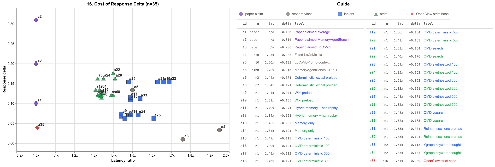

# Benchmark Findings

These are small local benchmark runs for the MLX sidecar and optional δ-mem adapter path. They are useful for implementation direction, not paper-grade claims.

Public repo: https://github.com/elimaine/delta-mem-mlx-sidecar-w-openclaw

Version: `v0.2.1`<br>
Last updated: `2026-05-17`

## Glossary

- **δ-mem**: the online memory adapter from the paper. It adds a compact recurrent memory state around transformer attention instead of only replaying longer text context.
- **TSW adapter**: the token-sequential writing variant of δ-mem used by the released Qwen3-4B adapter and this MLX port.
- **MLX**: Apple's local array/runtime stack used here for Apple Silicon inference.
- **Sidecar**: this repo's OpenAI-compatible HTTP server around the local MLX model.
- **OpenClaw run**: a benchmark that uses OpenClaw-shaped session history, OpenClaw memory fixtures, or live/sanitized OpenClaw transcripts.
- **Non-OpenClaw run**: a benchmark that tests the sidecar/model directly with synthetic prompts or LoCoMo-style data and does not depend on OpenClaw session structure.
- **Plain/base score**: the frozen backbone or no-history condition used as the comparison point.
- **δ-mem score**: the same local model path with the δ-mem adapter/state path active.
- **Replayed history**: sanitized session turns are first written into a stable sidecar session key, then probes are asked against that session.
- **No-history base**: probes are asked in a fresh session without replaying the transcript first.
- **Lift / ratio**: δ-mem score divided by plain/base score. Do not use lift when the base score is zero; use absolute delta instead.
- **Strict scorer**: the current OpenClaw replay scorer, which requires all expected evidence, numeric evidence for numeric claims, and real negation for negated facts.
- **Older/lenient scorer**: earlier local OpenClaw replay results before the scorer was tightened. These are useful directional results, not final claims.
- **QMD search / vsearch**: local markdown retrieval over sanitized fixtures; `search` is lexical/BM25-style, `vsearch` is vector similarity. Retrieved snippets are written during the memory preload/replay phase, not passed directly in the final probe prompt.
- **Ygraph thoughts**: graph-derived candidate memory statements from the local OpenClaw/ygraph workspace.
- **Memorg**: the local memory-organization fixture/context pack used in earlier OpenClaw-shaped tests.

## Shareable Summary

The strongest local comparisons improved with the δ-mem TSW adapter attached, but the evidence splits into clear categories. Score here is based on correct answers.

- **Non-OpenClaw local tests**: corrected LoCoMo-10 showed a small `1.07x` score lift with about `1.95x` total runtime.
- **OpenClaw-shaped local tests**: curated/retrieved memory-preload runs showed larger directional gains, up to `1.30x`, but most of those used the older lenient scorer.
- **Strict broad OpenClaw test**: the newer 16-transcript replay showed only weak exact-recall recovery: `+0.0391` absolute score delta, not a ratio, because the no-history base was `0.0000`.

That alone is reason to be excited about this.

Preloading memory into the weights has proven difficult to pin down. Possibly because of the small model size. I am currently exploring this; see the benchmark details below.

The important caveat is that preload volume by itself was not predictive. Compact, relevant QMD snippets worked better than larger, richer wiki/ygraph preloads. Ygraph is a local, unreleased graph-memory system, so those rows should be read as exploratory internal memory-preload tests. That suggests the current bottleneck may be retrieval quality, fact density, and wording shape rather than simply adding more memory.

## Paper vs Local Apple Silicon Runs

These rows are not apples-to-apples benchmark reproductions. They separate the paper's research setup from this repo's local Apple Silicon appraisal setup.

| Dimension | δ-mem paper runs | Local Apple Silicon runs |
| --- | --- | --- |
| Hardware | 8x NVIDIA A800 GPUs | Apple M4 Pro Mac mini, 64 GB unified memory |
| Runtime stack | PyTorch/CUDA; distributed research/training setup | MLX; local OpenAI-compatible sidecar |
| Model family | Qwen3-4B-Instruct backbone with δ-mem adapter | Qwen3-4B-Instruct MLX backbone with converted δ-mem adapter |
| OpenClaw involved? | No | Mixed: some direct sidecar tests, some OpenClaw-shaped/session replay tests |
| Benchmarks | Paper benchmark suite, including MemoryAgentBench and LoCoMo | Small local synthetic probes, LoCoMo-10 sample, MemoryAgentBench CR 6k selected config, curated OpenClaw fixtures, sanitized OpenClaw transcripts |
| Paper-reported accuracy lift | `1.10x` average, `1.31x` MemoryAgentBench, `1.20x` LoCoMo over frozen backbone | Best local non-OpenClaw: `1.07x` LoCoMo-10. Best local OpenClaw-shaped older result: `1.30x` QMD retrieved-memory preload. Strict OpenClaw-16: `+0.0391` absolute score delta |
| Speed/latency | Paper says δ-mem adds decode overhead while keeping memory footprint lightweight | Local strongest-context runs showed about `1.26x` to `1.69x` probe-latency slowdown; strict OpenClaw-16 was `1.01x` replay/base latency |
| What this proves | δ-mem can improve memory-heavy benchmark accuracy under the authors' setup | The MLX sidecar can run/appraise the adapter locally; current local results are promising but not yet paper-grade |

## Run Classification

Use this section when comparing results. The paper rows and local LoCoMo rows are **not OpenClaw runs**. Rows marked OpenClaw use OpenClaw-shaped session structure, OpenClaw memory fixtures, or sanitized OpenClaw transcript replay. Rows using the older lenient scorer should not be compared as exact accuracy claims against the strict OpenClaw-16 replay.

| Run family | OpenClaw run? | Source/context | Scoring status | Best result shown below |
| --- | --- | --- | --- | --- |
| δ-mem paper benchmark suite | No | Authors' Qwen3-4B-Instruct research setup on A800 GPUs | Paper-reported benchmark scores | `1.10x` average, `1.31x` MemoryAgentBench, `1.20x` LoCoMo |
| Local synthetic paper-style probes | No | Direct local sidecar prompts | Local exploratory scorer | Flat / no reliable lift |
| Fixed local LoCoMo-10 | No | Direct local LoCoMo-style sample | Corrected local scorer | `1.07x` score lift |
| Sanitized OpenClaw raw replay | Yes | Sanitized OpenClaw-shaped session replay | Older lenient scorer | `1.17x` score lift |
| OpenClaw retrieved-memory preload variants | Yes | QMD/ygraph/memorg write events plus target replay | Older lenient scorer | Up to `1.30x` score lift |
| OpenClaw-16 sanitized transcript replay | Yes | 16 live OpenClaw transcripts exported from local session files and sanitized | Current strict scorer | `+0.0391` absolute score delta |

## Most Interesting Results

| Test | OpenClaw? | Scorer / caveat | Plain/base score | δ-mem/replay score | Lift or delta | Slowdown | Why it matters |
| --- | --- | --- | ---: | ---: | ---: | ---: | --- |
| Fixed LoCoMo-10 session-context | No | LoCoMo-style local sample | `0.4667` | `0.5000` | `1.07x` | `1.95x` total runtime | Corrected the bad no-context baseline; shows a small but plausible memory gain outside OpenClaw. |
| MemoryAgentBench CR 6k full | No | 100-query selected config slice; exact-match chart score | `0.1000` | `0.1100` | `+0.0100` absolute | `1.76x` query latency | Replaces the earlier smoke point with a larger local MemoryAgentBench-style run; still far below paper scale. |
| Sanitized OpenClaw raw replay | Yes | Older lenient scorer | `0.5701` | `0.6667` | `1.17x` | `1.30x` probe latency | Best early practical OpenClaw-shaped result before strict rescoring. |
| Hybrid memory + half replay | Yes | Older lenient scorer | `0.5625` | `0.6208` | `1.10x` | `1.49x` probe latency | Shows structured memory plus partial replay can help. |
| QMD search snippets + target replay | Yes | Older lenient scorer | `0.5625` | `0.7292` | `1.30x` | `1.63x` probe latency | Strongest retrieved-memory preload result from BM25/full-text retrieval. |
| QMD vsearch snippets + target replay | Yes | Older lenient scorer | `0.5625` | `0.7292` | `1.30x` | `1.48x` probe latency | Vector retrieval matched QMD search quality with slightly lower latency ratio. |
| Reduced QMD deterministic preload, ~490 tokens | Yes | Older lenient scorer | `0.5625` | `0.7292` | `1.30x` | `1.66x` probe latency | Smaller, ranked QMD sections preserved the right facts. |
| Reduced QMD synthesized preload, ~95 tokens | Yes | Older lenient scorer | `0.5625` | `0.7292` | `1.30x` | `1.69x` probe latency | Very small fact-style preload tied the best score, suggesting fact density matters more than volume. |
| OpenClaw-16 sanitized transcript replay | Yes | Current strict scorer | `0.0000` | `0.0391` | `+0.0391` absolute | `1.01x` replay/base latency | Broader and stricter; shows weak exact-recall recovery rather than strong accuracy. |

## Cost of Response Delta Chart



Chart version `v0.2` promotes the artifact-driven response-delta scatterplot. It is generated from benchmark JSON/JSONL artifacts, not hand-entered chart rows. The tracked chart asset is public; the full local run artifacts remain ignored under `benchmarks/results/`.

The chart includes paper claim reference points, local non-OpenClaw rows, saved OpenClaw replay rows rescored with the stricter scorer, fresh strict OpenClaw replay reruns, and the OpenClaw `n16` strict base. Paper rows use `n/a` latency in the guide because the paper does not provide a comparable local latency ratio; they are plotted on the `1.0x` reference rail only for visual comparison.

## Verification Pass

Version `v0.2.1` rechecked the public benchmark claims against the local JSON/JSONL artifacts on 2026-05-17. The checked values line up with the source data below.

| Claim | Source artifact | Verified value |
| --- | --- | --- |
| Fixed LoCoMo-10 session-context score | `benchmarks/results/locomo10-sidecar-*-context.json` | `0.4667` plain, `0.5000` δ-mem, `1.95x` elapsed runtime |
| MemoryAgentBench CR 6k full score | `benchmarks/results/memoryagentbench-factconsolidation-sh-6k-*.json` | `0.1000` plain exact match, `0.1100` δ-mem exact match, `1.76x` query latency |
| OpenClaw-16 strict replay | `benchmarks/results/openclaw-16/report/summary.json` | `0.0000` base, `0.0391` replay, `+0.0391` delta, `1.01x` latency |
| QMD search preload row | `benchmarks/results/openclaw-qmd-search-*.json` and `openclaw-qmd-search-injected.jsonl` | `0.5625` plain, `0.7292` δ-mem, `1.30x` lift, `1.63x` probe latency, 8 events, `~605` preload tokens |
| QMD vsearch preload row | `benchmarks/results/openclaw-qmd-vsearch-*.json` and `openclaw-qmd-vsearch-injected.jsonl` | `0.5625` plain, `0.7292` δ-mem, `1.30x` lift, `1.48x` probe latency, 8 events, `~608` preload tokens |

The table sections intentionally report the older lenient OpenClaw preload scores where marked. The response-delta chart also includes stricter rescored/fresh strict points; those are plotted as deltas rather than replacing the older lenient ratio tables.

## Current Read

The results are encouraging because the adapter can improve behavior on memory-shaped tasks, but the mechanism is not yet cleanly controlled. Memory preloading can help, hurt, or do nothing depending on what gets injected. The strongest signal so far is not "more context"; it is "the right facts, in the right form, at the right point in the session."

The δ-mem paper reports meaningful gains using Qwen3-4B-Instruct: `1.10x` average over the frozen backbone, `1.31x` on MemoryAgentBench, and `1.20x` on LoCoMo. Our local synthetic paper-style probes were flat, corrected LoCoMo and curated OpenClaw-shaped replay showed positive signal, and the broader strict 16-transcript replay now shows only weak exact-recall recovery.

## OpenClaw 16 Transcript Replay

Run date: 2026-05-16. Source: live OpenClaw session files exported from local session files, then sanitized locally. Very large sessions were excluded with a 3 MB cap. The run used 16 sanitized transcripts, 8 deterministic probes per transcript, and a no-history base case for each transcript. Calls were single-threaded against the local `delta-mem-qwen3-4b-mlx` sidecar.

| Metric | No-history base | Replayed history |
| --- | ---: | ---: |
| Mean score | `0.0000` | `0.0391` |
| Pass rate | `0.0000` | `0.0391` |
| Mean probe latency | `598.9 ms` | `603.8 ms` |

Mean paired score delta was `+0.0391`, with rough 95% CI `+0.0097` to `+0.0684`. Win rate was `0.3125`; 5 of 16 transcripts showed a positive replay delta. Replay probe latency was effectively flat at `1.01x` base latency.

Interpretation: this is a weak positive memory signal, not a strong accuracy result. The base model did not answer sanitized transcript facts without replay, while replay recovered a small number of header/session facts. The low absolute score suggests the current deterministic probes are harder than the model can reliably satisfy after replay, or that replayed δ-state is not enough for exact marker/topic recall.

The useful outcome is the toolbelt: repeatable sanitized transcript export, probe generation, JSON/JSONL capture, and graph generation hooks for larger confidence runs. The strongest visual story should not be a generic bar chart; it should show probe-level recovery, paired transcript deltas, and normalized paper/local comparisons without pretending these are the same benchmark.

Artifacts live under ignored local paths such as `benchmarks/results/openclaw-16/run/results.jsonl`, `benchmarks/results/openclaw-16/report/summary.json`, and the generated graph/report folders.

## Chart Reproduction

The promoted `v0.2` chart is generated by:

```sh
python benchmarks/latency_scatterplot.py \
  --results-dir benchmarks/results \
  --summary-json benchmarks/results/openclaw-16/report/summary.json \
  --output benchmarks/results/openclaw-16/altair-report/16-cost-of-memory-signal.png
```

The generator reads paired `*-plain.json` and `*-delta.json` result files, strict-rescores saved OpenClaw probe outputs when available, and uses `benchmarks/fixtures/research-claimed-results.jsonl` for the paper reference rows. `benchmarks/results/` is ignored so local transcripts, raw outputs, and run artifacts are not committed.

## Retrieval Terms

QMD is a local markdown retrieval tool. In these tests, `qmd search` means BM25/full-text retrieval and `qmd vsearch` means embedding/vector similarity retrieval. The retrieval tests used an isolated QMD index over sanitized OpenClaw memory fixtures so they did not mutate an operator's live index.

Ygraph thoughts are graph-derived thought atoms from the local OpenClaw/ygraph workspace. They are candidate memory statements with provenance-style metadata. In this benchmark they were selected deterministically by keyword overlap, then written as memory-preload events.

Cognee is a graph/RAG-style memory system referenced by the local memory-stack notes. It was not on the active hot path for these benchmark runs; the ygraph-selected thoughts mostly referenced Cognee as background process-memory context.

## Retrieved Memory Preload Results

This table compares OpenClaw-shaped memory preload variants using the same 8-probe evaluation set. Retrieved QMD/ygraph/memorg material was written into the sidecar session before the probes; the final probe prompts did not include those snippets as direct context.

| Variant | Preload events | Est. preload tokens | Plain | δ-mem | Ratio | Δ | Pass | Probe latency ratio |
| --- | ---: | ---: | ---: | ---: | ---: | ---: | --- | ---: |
| memorg only | `12` | `~386` | `0.5625` | `0.5292` | `0.94x` | `-0.0333` | `5/8 -> 5/8` | `1.46x` |
| hybrid memory + half replay | `18` | `~550` | `0.5625` | `0.6208` | `1.10x` | `+0.0583` | `5/8 -> 6/8` | `1.49x` |
| related sessions preload + target replay | `19` | `~538` | `0.5625` | `0.5958` | `1.06x` | `+0.0333` | `5/8 -> 6/8` | `1.53x` |
| curated wiki + target replay | `15` | `~678` | `0.5625` | `0.5542` | `0.99x` | `-0.0083` | `5/8 -> 6/8` | `1.44x` |
| deterministic lexical context list + target replay | `19` | `~893` | `0.5625` | `0.5542` | `0.99x` | `-0.0083` | `5/8 -> 6/8` | `1.44x` |
| ygraph keyword thoughts + target replay | `8` | `~1069` | `0.5625` | `0.6042` | `1.07x` | `+0.0417` | `5/8 -> 6/8` | `1.54x` |
| QMD search snippets + target replay | `8` | `~605` | `0.5625` | `0.7292` | `1.30x` | `+0.1667` | `5/8 -> 7/8` | `1.63x` |
| QMD vsearch snippets + target replay | `8` | `~608` | `0.5625` | `0.7292` | `1.30x` | `+0.1667` | `5/8 -> 7/8` | `1.48x` |

## Reduced QMD Preload Sweep

This sweep kept the target replay constant and varied only the QMD memory-preload budget. "Deterministic" means full QMD-hit document sections ranked by lexical overlap with probe terms. "Synthesized" means direct fact-style preload events synthesized from the same retrieved sanitized fixtures.

| Method | Preload budget | Actual preload tokens | Total tokens | Plain | δ-mem | Ratio | Δ | Pass | Latency ratio |
| --- | ---: | ---: | ---: | ---: | ---: | ---: | ---: | --- | ---: |
| deterministic | `500` | `~490` | `~688` | `0.5625` | `0.7292` | `1.30x` | `+0.1667` | `5/8 -> 7/8` | `1.66x` |
| deterministic | `400` | `~398` | `~596` | `0.5625` | `0.5542` | `0.99x` | `-0.0083` | `5/8 -> 6/8` | `1.57x` |
| deterministic | `300` | `~296` | `~493` | `0.5625` | `0.6042` | `1.07x` | `+0.0417` | `5/8 -> 6/8` | `1.49x` |
| deterministic | `200` | `~185` | `~382` | `0.5625` | `0.6042` | `1.07x` | `+0.0417` | `5/8 -> 6/8` | `1.26x` |
| deterministic | `100` | `~98` | `~295` | `0.5625` | `0.6042` | `1.07x` | `+0.0417` | `5/8 -> 6/8` | `1.49x` |
| synthesized | `500` | `~440` | `~638` | `0.5625` | `0.5542` | `0.99x` | `-0.0083` | `5/8 -> 6/8` | `1.48x` |
| synthesized | `400` | `~390` | `~588` | `0.5625` | `0.5542` | `0.99x` | `-0.0083` | `5/8 -> 6/8` | `1.53x` |
| synthesized | `300` | `~299` | `~496` | `0.5625` | `0.5292` | `0.94x` | `-0.0333` | `5/8 -> 5/8` | `1.61x` |
| synthesized | `200` | `~194` | `~392` | `0.5625` | `0.5542` | `0.99x` | `-0.0083` | `5/8 -> 6/8` | `1.67x` |
| synthesized | `100` | `~95` | `~293` | `0.5625` | `0.7292` | `1.30x` | `+0.1667` | `5/8 -> 7/8` | `1.69x` |

Reducing the preload can help, but not smoothly by token count. The deterministic 500-token pack and synthesized 100-token pack tied for best result (`1.30x`). Intermediate budgets often regressed toward zero or below baseline. This strongly suggests the important variable is whether the reduced preload preserves the right high-priority facts in a usable order, not raw token volume.

## Reproduction Outline

- Build an isolated QMD index for the sanitized memory corpus.
- Run `qmd search` and `qmd vsearch` against the same corpus and query.
- Convert retrieved snippets into memory-preload/write-event fixtures with the same target replay.
- Compare plain backbone and δ-mem sidecar runs with the same probes, temperature, and max-token settings.
- Record context event count, estimated token count, score, pass rate, and latency for each run.
